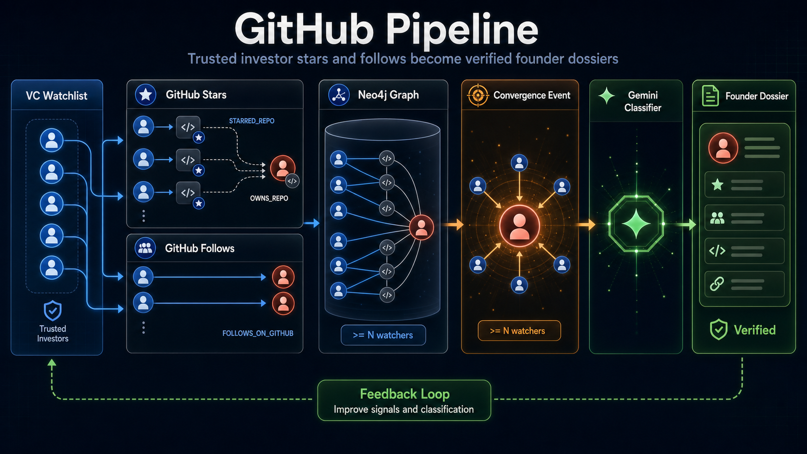

# GitHub Pipeline — End-to-End Flow

> **Purpose of this doc.** A diagram-grade reference of how a GitHub event (a star, a follow) becomes a scored convergence signal and ultimately a verified founder dossier delivered to the user. Use this as the source of truth when generating flow charts, Figma diagrams, or image-generator prompts. Every box and arrow you see in a diagram should correspond to a stage / artifact / edge listed here.



---

## 0. The one-paragraph mental model

The system watches a curated list of investors ("active watchlist") on GitHub. Every few hours it polls each watcher's **stars** and **follows**. Each new edge is written into a Neo4j knowledge graph as a temporal relationship. When **N or more distinct watchers** independently touch the **same target Person** within a recent time window, that triggers a `ConvergenceEvent`. High-scoring events are then enriched (GitHub profile, repos, Twitter, KB cross-check), classified by an LLM (`founder | investor | operator | unclear | not_relevant`), and stored as a **Dossier** that the user can review and give feedback on.

```
Active VC Watchlist (CSV) ──► GitHub API (stars + follows) ──► Neo4j edges
                                                                  │
                                                                  ▼
                                          Convergence detector (≥N watchers, windowed)
                                                                  │
                                                                  ▼
                                                         ConvergenceEvent node
                                                                  │
                                                                  ▼
                                              Enrichment (graph + GH + X + KB)
                                                                  │
                                                                  ▼
                                                  Gemini Classifier  →  Dossier node
                                                                  │
                                                                  ▼
                                       Backend API  →  Frontend  →  User feedback
```

---

## 1. Pipeline stages (in execution order)

| # | Stage | Code entrypoint | Input | Output | Trigger |
|---|---|---|---|---|---|
| 1 | Watchlist load | `scripts/load_investor_reference.py`, `scripts/promote_active_watchlist.py` | `data/investors_clean.csv`, `data/active_watchlist.csv` | `Person` + `WATCHED_BY {tier}` edges in Neo4j | Manual, one-off |
| 2 | Star ingest | `scrapers/jobs/fetch_starred_repos.py` → `scrapers/pipeline.py:ingest_stars` | active watchlist GitHub handles | `Repository` nodes + `STARRED_REPO` edges | Manual CLI / scheduler (M12) |
| 3 | Follow ingest | `scrapers/jobs/fetch_following.py` → `scrapers/pipeline.py:ingest_follows` | active watchlist GitHub handles | `Person` nodes (followed users) + `FOLLOWS_ON_GITHUB` edges | Manual CLI / scheduler (M12) |
| 4 | Identity resolution | `identity/resolver.py` (called inside ingest + load jobs) | (platform, handle, profile blob) | canonical_id → `Person` + `HAS_IDENTITY` → `PlatformIdentity` | On every Person upsert |
| 5 | Convergence detection | `intelligence/convergence.py:find_convergences` | edges in window, alert rule | `ConvergenceEvent` node + `ABOUT` edge | Manual `python -m intelligence.convergence --persist` / scheduler |
| 6 | Dossier enrichment | `intelligence/dossier/enrichment.py:enrich` | `ConvergenceEvent.target_person_id` | `EnrichmentBundle` (in-memory JSON) | Dossier sweep |
| 7 | Classification | `intelligence/dossier/classifier.py:GeminiClassifier.classify` | `EnrichmentBundle` | `Classification {role, confidence, narrative, key_signals…}` + `data/dossier_classifications.jsonl` | Dossier sweep |
| 8 | Dossier persist | `intelligence/dossier/dossier.py:build_or_update` | classification + bundle | `Dossier` node + `DOSSIER_FOR`, `BUILT_FROM` edges | Dossier sweep |
| 9 | API serve | `backend/app.py` | Neo4j read | `/api/founders`, `/api/alerts`, `/api/dossier/{id}`, `/api/graph` | HTTP |
| 10 | Feedback | `intelligence/dossier/feedback.py:submit_feedback` (POST `/api/dossier/{id}/feedback`) | user verdict | `DossierFeedback` node, status flip | User action |

---

## 2. VC roles & watchlist concepts

There are **three distinct populations** of investors in the graph. They are NOT the same set.

### 2.1 Reference investors (the "knowledge base")

- **Source:** `data/investors_clean.csv` (≈1000 angels/VCs).
- **Loader:** `scripts/load_investor_reference.py`.
- **Effect in Neo4j:** creates a `Person` node with `investor_type` (e.g. `Angel`, `VC`), `country`, optional `twitter_handle`. NO `WATCHED_BY` edge.
- **Role:** ground-truth "is this person a known investor?" lookup used by the dossier classifier (KB match / cross-check).

### 2.2 Active watchlist (the polling set)

- **Source:** `data/active_watchlist.csv` (~tens of handles).
- **Format:** `display_name, github_handle, archetype, source, rationale`.
- **Loader:** `scripts/promote_active_watchlist.py`.
- **Effect in Neo4j:**
  1. Tries to match an existing `Person` by `display_name` (case-insensitive).
  2. If not found, creates an **augmentation Person** with deterministic `uuid5("gh:" + github_handle_lower)`.
  3. MERGEs `(p)-[:HAS_IDENTITY]->(:PlatformIdentity {platform:'github', handle})`.
  4. MERGEs `(p)-[:WATCHED_BY {tier:'active', archetype, added_at, notes}]->(:User {id:'demo'})`.
- **Role:** these are the **only** Persons whose stars and follows are actively scraped from GitHub.
- **Archetypes seen in CSV:** `angel`, `angel_operator` (default).

### 2.3 Twitter-side reference watchers (M8)

Same `WATCHED_BY {tier:'active'}` mechanism but over Twitter. See `docs/X_PIPELINE.md`. Some Persons end up watched on both platforms via identity resolution.

### 2.4 Tier semantics

`WATCHED_BY.tier`:

- `active` → polled by both GitHub and Twitter ingest jobs; their edges feed the convergence detector.
- `reference` → known investor, but not actively polled. Used for KB lookups only.

> A target who is themselves a watcher (`tier:'active'`) is excluded from being a convergence target via the `exclude_active_watchers` rule (default true).

---

## 3. GitHub graph schema (Neo4j)

### 3.1 Node labels

| Label | Unique constraint | Key properties |
|---|---|---|
| `Person` | `canonical_id` | `display_name`, `investor_type`, `country`, `sector_tags`, `stage_tags`, `role_tags`, `confidence_score`, `entity_type` |
| `PlatformIdentity` | `(platform, handle)` | `handle_original`, `profile_url`, `verified_via`, `confidence`, `kind`, `first_observed_at` |
| `Repository` | `github_id` | `owner_handle`, `name`, `full_name`, `description`, `language`, `star_count_observed`, `html_url` |
| `User` | `id` | `created_at` (only `id='demo'` exists in Phase 1) |
| `ConvergenceEvent` | `id` | `target_person_id`, `user_id`, `fired_at`, `window_start`, `window_end`, `distinct_member_count`, `member_ids`, `score`, `score_breakdown_json`, `signal_type_counts_json`, `evidence_json` |
| `Dossier` | `id` | `target_person_id`, `user_id`, `classification`, `confidence`, `narrative`, `key_signals_json`, `status`, `evidence_bundle_json` |
| `DossierFeedback` | `id` | `dossier_id`, `verdict`, `corrected_classification`, `notes`, `submitted_at`, `side_effect` |

### 3.2 Edge types (all have `first_seen_at`)

```
Person ─[:HAS_IDENTITY]──────────► PlatformIdentity
Person ─[:STARRED_REPO]──────────► Repository       {first_seen_at, last_seen_at}
Person ─[:OWNS_REPO]─────────────► Repository       {first_seen_at}
Person ─[:FOLLOWS_ON_GITHUB]─────► Person           {first_seen_at, last_seen_at}
Person ─[:FOLLOWS_ON_TWITTER]────► Person           {first_seen_at, last_seen_at, removed_at?, confidence, evidence_url, timing_basis}
Person ─[:WATCHED_BY]────────────► User             {tier, added_at, archetype, notes}
ConvergenceEvent ─[:ABOUT]───────► Person
Dossier ─[:DOSSIER_FOR]──────────► Person
Dossier ─[:BUILT_FROM]───────────► ConvergenceEvent
ConvergenceEvent ─[:CROSS_SEEN_VIA_CONVERGENCE]──► Person   (audit trail; M9.5.3)
DossierFeedback ─[:FEEDBACK_FOR]─► Dossier
DossierFeedback ─[:ABOUT_TARGET]─► Person
```

### 3.3 Cypher uniqueness constraints (`scripts/schema.cypher`)

```cypher
CREATE CONSTRAINT person_canonical_id          FOR (p:Person)            REQUIRE p.canonical_id IS UNIQUE;
CREATE CONSTRAINT platform_identity_handle     FOR (i:PlatformIdentity)  REQUIRE (i.platform, i.handle) IS UNIQUE;
CREATE CONSTRAINT repository_github_id         FOR (r:Repository)        REQUIRE r.github_id IS UNIQUE;
CREATE CONSTRAINT user_id                      FOR (u:User)              REQUIRE u.id IS UNIQUE;
CREATE CONSTRAINT convergence_event_id         FOR (c:ConvergenceEvent)  REQUIRE c.id IS UNIQUE;
CREATE INDEX person_display_name               FOR (p:Person)            ON (p.display_name);
CREATE INDEX starred_repo_first_seen           FOR ()-[r:STARRED_REPO]-()         ON (r.first_seen_at);
CREATE INDEX follows_github_first_seen         FOR ()-[r:FOLLOWS_ON_GITHUB]-()    ON (r.first_seen_at);
```

---

## 4. Star ingestion (deep)

### 4.1 API mechanics

- Endpoint: `GET https://api.github.com/users/{handle}/starred`
- Header: `Accept: application/vnd.github.star+json` (this gives us the `starred_at` timestamp; the default representation does not).
- Pagination: 100/page, follows the `Link rel="next"` header until exhausted or `max_pages` reached.
- Rate limiting (`scrapers/github_client.py`):
  - Multiple PATs rotate when `X-RateLimit-Remaining < 50`.
  - On `403/429`, exponential backoff; sleeps only after polling all tokens.
  - Budget assumption: 4 PATs × 5K/h = 20K/h.

### 4.2 `StarEvent` shape (per-page record)

```python
StarEvent(
    starred_at: str,          # ISO8601 — REAL timestamp from GitHub
    repo_full_name: str,
    repo_owner: str,
    repo_name: str,
    repo_description: str,
    repo_language: str,
    repo_star_count: int,
    repo_html_url: str,
    repo_github_id: int,
)
```

### 4.3 Cypher writes (per star event)

```cypher
// Repository upsert
MERGE (r:Repository {github_id: $github_id})
SET r.owner_handle = $owner_handle, r.name = $name, r.full_name = $full_name,
    r.description = $description, r.language = $language,
    r.star_count_observed = $star_count, r.html_url = $html_url;

// STARRED_REPO edge — append-only first_seen_at
MATCH (p:Person {canonical_id: $watcher_id})
MATCH (r:Repository {github_id: $github_id})
MERGE (p)-[s:STARRED_REPO]->(r)
ON CREATE SET s.first_seen_at = $starred_at, s.last_seen_at = $now_iso
ON MATCH  SET s.last_seen_at = $now_iso;
```

### 4.4 OWNS_REPO inference

Opportunistic: when the repo's `owner_handle` matches an existing `PlatformIdentity {platform:'github', handle}`, MERGE `(owner:Person)-[:OWNS_REPO {first_seen_at}]->(repo)`. This is what makes a STARRED_REPO edge become a convergence signal *to a person* (the owner) rather than just to a repo.

### 4.5 Idempotency / dedup

- MERGE on `(Person, Repository)` — re-running only updates `last_seen_at`.
- `first_seen_at` is **append-only**; it preserves the real GitHub `starred_at` even across re-ingests.
- No tombstones: an unstarred repo just stops getting `last_seen_at` updates.

---

## 5. Follow ingestion (deep)

- Endpoint: `GET https://api.github.com/users/{handle}/following`
- Per-page record: `FollowEntry(handle, github_id, profile_url, avatar_url, type)`.
- `type='Organization'` is filtered at the boundary (orgs are not Persons in our model).
- **GitHub does not expose a real follow timestamp.** `first_seen_at` is set to the **poll time** on edge creation. Implication: time-based convergence on follows is bounded by polling cadence, not real follow events.
- Cypher:

```cypher
MERGE (target:Person)-[:HAS_IDENTITY]->(pi:PlatformIdentity {platform:'github', handle:$h})
ON CREATE SET pi.first_observed_at = $now_iso, pi.profile_url = $url, pi.confidence = 0.9
WITH target
MATCH (watcher:Person {canonical_id: $watcher_id})
MERGE (watcher)-[f:FOLLOWS_ON_GITHUB]->(target)
ON CREATE SET f.first_seen_at = $now_iso, f.last_seen_at = $now_iso
ON MATCH  SET f.last_seen_at = $now_iso;
```

---

## 6. Identity resolution

Called whenever a new `(platform, handle)` is observed (during star ingest if owner not known, during follow ingest, during Twitter signal load, etc.). See `identity/resolver.py:Resolver.resolve(platform, handle, profile_blob)`.

```
        ┌─────────────────────────────────────────────────────┐
        │  Tier 0 — graph hit                                  │
        │  Already have (platform, handle) → return canonical │
        └─────────────────────────────────────────────────────┘
                              │ miss
                              ▼
        ┌─────────────────────────────────────────────────────┐
        │  Tier 1 — Override CSV                               │
        │  data/identity_overrides.csv                         │
        │  (display_name,role,github,linkedin,twitter,notes)   │
        └─────────────────────────────────────────────────────┘
                              │ miss
                              ▼
        ┌─────────────────────────────────────────────────────┐
        │  Tier 2 — Bio link extraction                        │
        │  identity/bio_link_extractor.py                      │
        │  parses bio for github.com/x, twitter.com/x, etc.    │
        └─────────────────────────────────────────────────────┘
                              │ miss
                              ▼
        ┌─────────────────────────────────────────────────────┐
        │  Tier 3 — LLM arbitration (gated)                    │
        │  identity/candidate_finder.py finds top-K Persons    │
        │  identity/llm_arbiter.py asks Gemini: same/diff?     │
        │  auto-merge only if confidence ≥ 0.85                │
        │  every verdict logged → data/identity_decisions.jsonl│
        └─────────────────────────────────────────────────────┘
                              │ no candidates / low conf
                              ▼
        ┌─────────────────────────────────────────────────────┐
        │  Tier 4 — Fresh Person                               │
        │  canonical_id = uuid5(NS, "gh:<handle_lower>")       │
        └─────────────────────────────────────────────────────┘
```

Cost gate: if `candidate_finder` returns zero plausible matches, Tier 3 is **skipped** (no LLM call).

---

## 7. Convergence detection

### 7.1 Trigger

```
python -m intelligence.convergence --user demo --persist [--as-of YYYY-MM-DD]
```

or scheduler stage `_stage_convergence` (every `PIPELINE_INTERVAL_HOURS`, default 6h).

### 7.2 Alert rule (`data/alert_rules.json`)

```json
{
  "demo": {
    "exclude_active_watchers": true,
    "limit": 100,
    "min_distinct_watchers": 2,
    "min_score": 0.0,
    "role_tag_filter": [],
    "signal_types": ["FOLLOWS_ON_GITHUB", "STARRED_REPO", "FOLLOWS_ON_TWITTER"],
    "sort_by": "score",
    "twitter_signal_min_confidence": 0.0,
    "weight_distinct_members": 1.0,
    "weight_member_quality": 0.0,
    "weight_recency": 1.0,
    "window_days": 1100
  }
}
```

### 7.3 Unified Cypher (3 branches → UNION)

```cypher
// Branch 1 — direct GitHub follow
MATCH (w:Person)-[:WATCHED_BY {tier:'active'}]->(:User {id:$user})
MATCH (w)-[e:FOLLOWS_ON_GITHUB]->(t:Person)
WHERE e.first_seen_at >= datetime($window_start)
  AND e.first_seen_at <= datetime($window_end)
  AND NOT (t)-[:WATCHED_BY {tier:'active'}]->(:User {id:$user})
RETURN w, t, e.first_seen_at AS edge_at, 'FOLLOWS_ON_GITHUB' AS signal_type, NULL AS confidence

UNION ALL

// Branch 2 — STARRED_REPO via OWNS_REPO bridge
MATCH (w:Person)-[:WATCHED_BY {tier:'active'}]->(:User {id:$user})
MATCH (w)-[s:STARRED_REPO]->(r:Repository)<-[:OWNS_REPO]-(t:Person)
WHERE s.first_seen_at >= datetime($window_start)
  AND s.first_seen_at <= datetime($window_end)
  AND NOT (t)-[:WATCHED_BY {tier:'active'}]->(:User {id:$user})
RETURN w, t, s.first_seen_at AS edge_at, 'STARRED_REPO' AS signal_type, NULL AS confidence

UNION ALL

// Branch 3 — Twitter follow (see X_PIPELINE.md)
MATCH (w:Person)-[:WATCHED_BY]->(:User {id:$user})
MATCH (w)-[e:FOLLOWS_ON_TWITTER]->(t:Person)
WHERE e.first_seen_at >= datetime($window_start)
  AND e.first_seen_at <= datetime($window_end)
  AND coalesce(e.confidence, 1.0) >= $twitter_min_confidence
  AND NOT (t)-[:WATCHED_BY {tier:'active'}]->(:User {id:$user})
RETURN w, t, e.first_seen_at AS edge_at, 'FOLLOWS_ON_TWITTER' AS signal_type, e.confidence AS confidence;
```

Python aggregation per target:
- `distinct_member_count = len({w.canonical_id})`
- `signal_type_counts = Counter(signal_type)`
- `evidence = [{watcher, signal_type, edge_at, evidence_url, confidence}, …]`

### 7.4 Score formula

```python
score = (
    distinct_member_count * weight_distinct_members
    + recency_bonus       * weight_recency
    + member_quality      * weight_member_quality        # 0 in Phase 2 MVP
    + target_prominence   * weight_target_prominence
)

recency_bonus     = max(0.0, 1.0 - (age_days(newest_edge) / window_days))
target_prominence = clip(log10(1 + max_owned_repo_stars) - 1.0, 0, log10(cap+1)-1)
```

Filter: `distinct_member_count >= min_distinct_watchers` AND `score >= min_score`.

### 7.5 Persistence

- Stable id: `cv-{user_id}-{target_id}-{window_end_date}` (so re-runs UPSERT, not duplicate).
- Stale events for the same user that drop out of the window get DELETEd (`DELETE_STALE_CONVERGENCE_EVENTS`).
- Edge `(:ConvergenceEvent)-[:ABOUT]->(:Person)` lets the frontend traverse from event → target.

---

## 8. Dossier flow

### 8.1 What triggers a dossier

A `ConvergenceEvent` whose `score >= dossier_score_threshold`. The dossier sweep walks all such events for a user (`QUERY_EVENTS_FOR_USER`).

### 8.2 Stage A — Enrichment (read-only)

`intelligence/dossier/enrichment.py:enrich(...)` returns:

```python
EnrichmentBundle(
    target_person,                 # Neo4j Person
    github_profile,                # GH /users/{h} (live)
    owned_repos[:5],               # by star count, via OWNS_REPO
    twitter_profile,               # Scrapebadger lookup_user (optional)
    recent_tweets[:10],            # Scrapebadger latest_tweets (optional)
    convergence_evidence,          # latest ConvergenceEvent
    cross_platform_followers,      # all watchers across all platforms
    kb_match,                      # is target in investors_clean.csv?
)
```

No Neo4j writes here.

### 8.3 Stage B — Classification (Gemini)

- Model: `gemini-2.5-flash`, `temperature=0.1`, `response_mime_type='application/json'`.
- Output schema:

```json
{
  "role": "founder | investor | operator | unclear | not_relevant",
  "confidence": 0.0,
  "narrative": "...",
  "key_signals": [{"text": "...", "evidence_url": "..."}],
  "recommended_action": "...",
  "cross_check_kb": {...}
}
```

- Hard rules in the system prompt: every narrative claim must be grounded in the bundle; KB match is ground truth; bias toward `unclear` when ambiguous.
- Every call appended to `data/dossier_classifications.jsonl`.

### 8.4 Stage C — Persist

`intelligence/dossier/dossier.py:build_or_update`:

1. Compute `bundle_hash = sha256(serialize(bundle))`.
2. If a `Dossier` for `(user, target)` exists with the same hash and `status='draft'` → return cached, **skip Gemini**.
3. Else: classify, then UPSERT:

```cypher
MERGE (d:Dossier {id: $dossier_id})
SET d.target_person_id = $target_id,
    d.user_id = $user_id,
    d.classification = $role,
    d.confidence = $confidence,
    d.narrative = $narrative,
    d.key_signals_json = $key_signals_json,
    d.evidence_bundle_json = $bundle_json,
    d.bundle_hash = $hash,
    d.status = $status,
    d.updated_at = datetime();
MERGE (d)-[:DOSSIER_FOR]->(:Person {canonical_id: $target_id});
WITH d UNWIND $event_ids AS eid
MATCH (e:ConvergenceEvent {id: eid})
MERGE (d)-[:BUILT_FROM]->(e);
```

### 8.5 Status state machine

```
   ┌─────────┐                           ┌──────────────┐
   │  draft  │──auto if conf≥0.85 ─────► │ready_to_send │──user "send"──► sent (immutable)
   └─────────┘    & role∈emit_set        └──────────────┘
        │                                       │
        │                                       │
        └──────── feedback ∈ {wrong_classification, wrong_target, spam} ───► rejected
```

### 8.6 Feedback loop (`intelligence/dossier/feedback.py`)

- Endpoint: `POST /api/dossier/{id}/feedback`.
- Body: `{verdict, corrected_classification?, notes?}`.
- Verdicts: `correct | wrong_classification | wrong_target | spam | low_priority`.
- Action:
  1. Append-only `DossierFeedback` node + `FEEDBACK_FOR` and `ABOUT_TARGET` edges.
  2. If verdict ∈ {`wrong_classification`, `wrong_target`, `spam`} AND status ∈ {`draft`, `ready_to_send`} → flip status to `rejected`.
  3. `sent` dossiers are immutable; feedback is recorded but no flip.
- Phase 1 does NOT re-train the classifier from feedback. M11 (Bayesian per-watcher precision) will consume feedback history later.

---

## 9. Backend API surface (GitHub-relevant)

| Method | Path | Returns | Notes |
|---|---|---|---|
| GET | `/api/health` | `{ok, neo4j, pipeline, generatedAt}` | Liveness + last pipeline run |
| GET | `/api/investors` | `Investor[]` | All `WATCHED_BY {tier:'active'}` Persons |
| GET | `/api/founders` | `Founder[]` | Convergence targets (not themselves active watchers) |
| GET | `/api/alerts` | `ConvergenceAlert[]` | Aggregated convergences per founder |
| GET | `/api/graph` | `{nodes, edges, topPickFounderId, generatedAt}` | Graph viz |
| GET | `/api/person/{id}` | `Investor \| Founder` | Single Person |
| GET | `/api/founder/{id}` | `Founder & {alerts, latest_dossier_id}` | Founder detail |
| GET | `/api/dossiers?user=demo&status=draft` | `Dossier[]` | List by status |
| GET | `/api/dossier/{id}` | parsed dossier with bundle | Full detail |
| POST | `/api/dossiers/regenerate` | `{started}` | `{target_id?, force_reclassify?}` |
| POST | `/api/dossier/{id}/feedback` | `{ok}` | Submit verdict |
| GET | `/api/dossier/{id}/feedback` | `Feedback[]` | History |
| POST | `/api/pipeline/run` | `{started}` | `{skip_twitter?: bool}` — manual trigger |
| GET | `/api/pipeline/status` | per-stage status | Last run state |

---

## 10. Scheduler

`backend/scheduler.py` runs the M12 pipeline:

```
every PIPELINE_INTERVAL_HOURS (default 6h):
    if not currently_running:
        _stage_github_ingest      → scrape stars + follows for active watchlist
        _stage_twitter_ingest     → see X_PIPELINE.md (skipped if PIPELINE_SKIP_TWITTER=1)
        _stage_convergence        → find_convergences --persist
        _stage_dossier_sweep      → enrich + classify + persist for events ≥ threshold
    write data/last_pipeline_run.json
```

Single-process mutex prevents overlapping runs. State persisted in `data/last_pipeline_run.json` (per-stage status + errors + timing).

Env vars:

| Var | Default | Effect |
|---|---|---|
| `PIPELINE_INTERVAL_HOURS` | `6` | Run cadence |
| `PIPELINE_RUN_ON_STARTUP` | `0` | Run immediately on boot |
| `PIPELINE_SKIP_TWITTER` | `0` | Skip Twitter stage |
| `PIPELINE_DOSSIER_SCORE_THRESHOLD` | `1.5` | Min score for dossier sweep |

---

## 11. End-to-end sequence — example: "Lovable / Anton Osika"

```
T-0     Watchlist seeded:
        active_watchlist.csv lists ~50 angels (Naval, Elad Gil, Sahil Lavingia, …)
        promote_active_watchlist.py creates Person + WATCHED_BY {tier:'active'}.

T+1h    GitHub star ingest (active watchers):
        Multiple watchers star github.com/AntonOsika/gpt-engineer (Lovable's predecessor).
        Each emits:
          MERGE Repository {github_id: …}
          MERGE (watcher)-[:STARRED_REPO {first_seen_at: starred_at}]->(repo)
        AntonOsika is already a Person with PlatformIdentity {platform:'github', handle:'antonosika'}
        (loaded from data/identity_overrides.csv).
        OWNS_REPO inference fires:
          MERGE (anton)-[:OWNS_REPO]->(gpt_engineer_repo)

T+1h    GitHub follow ingest:
        Some watchers follow AntonOsika directly:
          MERGE (watcher)-[:FOLLOWS_ON_GITHUB {first_seen_at: now_iso}]->(anton)

T+1h05  Convergence detector runs:
        UNIFIED query unions FOLLOWS_ON_GITHUB ∪ STARRED_REPO→OWNS_REPO ∪ FOLLOWS_ON_TWITTER.
        Anton has 5 distinct watchers in the window.
        score = 5 * 1.0 + 0.78 * 1.0 + 0 + 0.6 = 6.38
        UPSERT ConvergenceEvent {id: cv-demo-{anton_id}-2026-05-01}
        MERGE (event)-[:ABOUT]->(anton)

T+1h10  Dossier sweep:
        Score > threshold → enrich:
          GH profile, top 5 repos, Twitter @antonosika via Scrapebadger,
          recent tweets, KB cross-check (not in investors_clean.csv → not an investor).
        Gemini classifies: role='founder', confidence=0.92, narrative=…
        Hash matches no prior → persist Dossier with status='ready_to_send'.

T+anytime  User opens /founder/{anton_id}:
        Backend hits Neo4j, returns founder + alerts + latest_dossier_id.
        Frontend renders dossier card with key_signals (each linked to evidence_url).
        User clicks "Looks good" → POST /api/dossier/{id}/feedback {verdict:'correct'}.
        DossierFeedback node persisted, status unchanged.
```

---

## 12. Diagram cheat-sheet (suggested boxes & arrows)

For Figma / image generators, use this as the canonical labeled-graph spec:

**Boxes (rectangles):**
- `active_watchlist.csv`
- `investors_clean.csv`
- `identity_overrides.csv`
- `GitHub REST API`
- `Star ingest (fetch_starred_repos.py)`
- `Follow ingest (fetch_following.py)`
- `Identity Resolver (4 tiers)`
- `Neo4j AuraDB` (one big cylinder containing the labels listed in §3.1)
- `Convergence Detector (intelligence/convergence.py)`
- `Alert rule (alert_rules.json)`
- `ConvergenceEvent`
- `Dossier Enrichment (enrichment.py)`
- `Gemini 2.5 Flash`
- `Dossier Persist (dossier.py)`
- `Dossier`
- `Backend API (FastAPI)`
- `Frontend (Next.js)`
- `User`
- `DossierFeedback`

**Arrows (with labels):**
- `active_watchlist.csv ──promote──► Person + WATCHED_BY{active}`
- `investors_clean.csv ──load──► Person (KB only)`
- `Active watchers ──poll stars──► GitHub API ──StarEvent──► Star ingest ──MERGE──► STARRED_REPO`
- `Active watchers ──poll following──► GitHub API ──FollowEntry──► Follow ingest ──MERGE──► FOLLOWS_ON_GITHUB`
- `Star ingest ──owner=known?──► OWNS_REPO`
- `Star/Follow ingest ──new (platform,handle)?──► Identity Resolver ──canonical_id──► Person`
- `Neo4j ──Cypher UNION──► Convergence Detector ──score──► ConvergenceEvent`
- `ConvergenceEvent ──score≥threshold──► Enrichment ──bundle──► Gemini ──classification──► Dossier`
- `Dossier ──auto-promote (conf≥0.85)──► status=ready_to_send`
- `Backend API ──GET /api/dossier──► Frontend ──user verdict──► POST feedback ──► DossierFeedback ──flip──► Dossier.status`

**Color suggestions:**
- Watchers / VCs → blue
- Founders / targets → red
- Repositories → grey
- ConvergenceEvent → orange (the "fire")
- Dossier → green
- Feedback → purple
