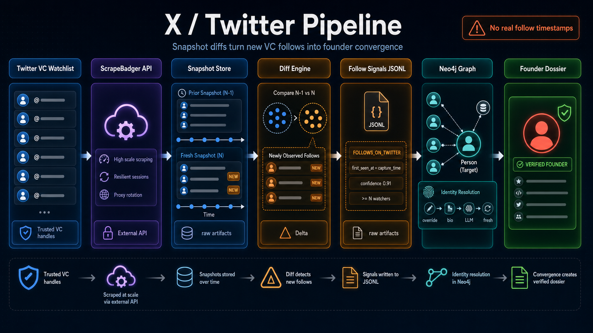

# X (Twitter) Pipeline — End-to-End Flow

> **Purpose of this doc.** A diagram-grade reference of how a Twitter event (a newly observed follow) becomes a scored convergence signal and ultimately a verified founder dossier. Companion to `GITHUB_PIPELINE.md` — many downstream stages (convergence, dossier, feedback) are shared between the two pipelines; this doc focuses on what is *Twitter-specific*. Use this as the source of truth when generating Figma diagrams or image-generator prompts.



---

## 0. The one-paragraph mental model

Twitter does not give us first-class follow timestamps. So we approximate them by **snapshotting** each VC's "following" list on a regular cadence and **diffing** consecutive snapshots: anyone who appears in snapshot N but was not in snapshot N-1 is treated as a *newly observed follow* with `first_seen_at = capture_time`. Snapshots come from **ScrapeBadger** (a third-party Twitter scraping API). New follows are emitted into a JSONL signal log, then loaded into Neo4j as `FOLLOWS_ON_TWITTER` edges. From there the pipeline is shared with the GitHub side: convergence detection unions Twitter and GitHub edges, and high-scoring `ConvergenceEvent`s feed into the same enrichment → Gemini classifier → Dossier flow.

```
twitter_vc_watchlist.txt ──► ScrapeBadger API
                                    │
                                    ▼
                         Snapshot file (per handle)
                                    │ (compared to prior)
                                    ▼
                 follow_signals.jsonl  +  raw_artifacts/
                                    │
                                    ▼
                  load_twitter_signals_to_neo4j.py
                                    │  (M7 identity resolver)
                                    ▼
                        FOLLOWS_ON_TWITTER edges
                                    │
                                    ▼
                Convergence Detector (UNION with GitHub)
                                    │
                                    ▼
                          ConvergenceEvent
                                    │
                                    ▼
                Enrichment ─► Gemini ─► Dossier ─► Feedback
```

---

## 1. Pipeline stages (in execution order)

| # | Stage | Code entrypoint | Input | Output | Trigger |
|---|---|---|---|---|---|
| 1 | Twitter watchlist build | `scripts/build_twitter_watchlist.py` | Neo4j (Persons w/ Twitter identity) | `data/twitter_vc_watchlist.txt` | Manual, periodic |
| 2 | ScrapeBadger snapshot + diff | `scripts/track_scrapebadger_twitter_follows.py` → `scrapers/jobs/fetch_twitter_followings.py` | watchlist handles, optional `data/twitter_interesting_people.txt` | `data/scrapebadger_twitter_snapshots/{handle}.json`, append to `data/scrapebadger_twitter_follow_signals.jsonl`, raw API blobs in `data/raw_artifacts/scrapebadger/` | Manual / scheduler (M12) |
| 3 | Identity resolution | `identity/resolver.py` (called from load job) | `(twitter, handle, profile_blob)` | canonical_id → `Person` + `HAS_IDENTITY` → `PlatformIdentity {platform:'twitter'}` | per-target during load |
| 4 | Signal → Neo4j load | `scrapers/jobs/load_twitter_signals_to_neo4j.py` | follow signals JSONL | `Person` (target) + `FOLLOWS_ON_TWITTER` edges | After Stage 2 |
| 5 | Convergence detection | `intelligence/convergence.py:find_convergences` | edges (Twitter ∪ GitHub) | `ConvergenceEvent` | scheduler / CLI |
| 6 | Enrichment | `intelligence/dossier/enrichment.py:enrich` | target + Twitter client + GH client | `EnrichmentBundle` (incl. recent tweets) | dossier sweep |
| 7 | Classification | `intelligence/dossier/classifier.py` | bundle | `Classification` + `data/dossier_classifications.jsonl` | dossier sweep |
| 8 | Dossier persist | `intelligence/dossier/dossier.py:build_or_update` | classification | `Dossier` node | dossier sweep |
| 9 | API serve | `backend/app.py` | Neo4j read | `/api/founders`, `/api/dossier/{id}`, `/api/alerts` | HTTP |
| 10 | Feedback | `intelligence/dossier/feedback.py` | user verdict | `DossierFeedback` node, status flip | user action |

---

## 2. VC roles & the Twitter watchlist

There are **two distinct lists** that drive the X pipeline.

### 2.1 `data/twitter_vc_watchlist.txt` (the polling set)

- **Built by:** `scripts/build_twitter_watchlist.py` — queries Neo4j and writes the file.
- **Inclusion rule:** Persons that have a Twitter `PlatformIdentity` AND either:
  - `WATCHED_BY {tier:'active'}` to the demo user, OR
  - `investor_type = 'Angel'` (i.e. they're in the reference investor KB).
- **Format:** lowercase Twitter handles, one per line (optionally preceded by `# display_name` comments).
- **Size:** ~76 handles in the current build.
- **Role:** these are the handles whose **followings** are scraped. They are the "voters" of the Twitter convergence signal.

### 2.2 `data/twitter_interesting_people.txt` (the optional target filter)

- **Format:** lowercase handles, one per line.
- **Currently:** only `antonosika` (the Lovable demo case).
- **Effect:** if present, diff signals are emitted ONLY when the new follow target is in this set. With `--all-following`, the filter is ignored and any new follow is emitted.
- **Role:** lets us focus snapshot diffs on a specific founder for the demo (cuts noise).

### 2.3 VC archetypes on the X side

The Twitter ingest itself does NOT assign archetypes. Persons carry their `investor_type` from the reference loader, and `WATCHED_BY {archetype}` from the active watchlist promotion. The convergence detector treats them all uniformly; the dossier classifier later uses `investor_type` for the KB cross-check.

> Important difference vs. GitHub: the Twitter convergence query does **not** require the watcher to have `tier:'active'`. It accepts any `WATCHED_BY` edge. This widens the pool to all 76 reference angels with Twitter handles, which is intentional for the M8 launch.

### 2.4 How a VC gets onto the X watchlist

```
investors_clean.csv ──load_investor_reference.py──► Person + PlatformIdentity{twitter}
                                                         │
                                                         ▼
                                               build_twitter_watchlist.py
                                                         │
                                                         ▼
                                           data/twitter_vc_watchlist.txt
                                                         │
                                                         ▼
                                       track_scrapebadger_twitter_follows.py
```

---

## 3. ScrapeBadger ingestion (deep)

### 3.1 What ScrapeBadger is

A third-party HTTP API that wraps Twitter/X scraping. We picked it over the official X API (cost / tier complexity) and over `twscrape` (account-pool maintenance burden). Free tier is rate-limited (~5 req/min); we stay well below by polling page 1 only by default.

### 3.2 Endpoints used

| Endpoint | Purpose | Used by |
|---|---|---|
| `GET /v1/twitter/users/{username}/by_username` | profile lookup | `lookup_user`, dossier enrichment |
| `GET /v1/twitter/users/{username}/followings[?cursor=…]` | paginated followings list | `list_followings`, snapshot job |
| `GET /v1/twitter/users/{username}/latest_tweets[?cursor=…]` | recent tweets | dossier enrichment |

Auth: `x-api-key: $SCRAPEBADGER_API_KEY` (env var, never logged).

### 3.3 Key client surface (`scrapers/clients/scrapebadger.py`)

```python
class ScrapebadgerClient:
    def lookup_user(username) -> TwitterUserRecord
    def list_followings(username, cursor=None) -> FollowingsPage
    def list_latest_tweets(username, cursor=None) -> TweetsPage
```

Each call writes the raw JSON response to `data/raw_artifacts/scrapebadger/<kind>/<subject>-<captured_at>.json` BEFORE parsing — gives us a replay log if the response shape ever changes.

### 3.4 Snapshot file layout (`data/scrapebadger_twitter_snapshots/{handle}.json`)

```json
{
  "source": "twitter",
  "provider": "scrapebadger",
  "subject": "twitter:akshay__mehra",
  "subject_id": "103549023",
  "captured_at": "2026-05-01T04:22:23.568786+00:00",
  "max_pages": 1,
  "following": [
    {
      "id": "1605",
      "username": "sama",
      "name": "Sam Altman",
      "followers_count": 4739589,
      "following_count": 1010,
      "verified": false
    }
    // …
  ]
}
```

- One file per watcher handle.
- Overwritten on each successful run (no per-run rotation; the diff happens in-memory before overwrite).
- `max_pages` records the depth of the snapshot. **Invariant:** baseline depth must equal diff depth on subsequent runs, otherwise targets sliding off page 2 will be reported as "newly observed."

### 3.5 Diff algorithm (`scrapers/jobs/fetch_twitter_followings.py`)

```python
def fetch_one_account(client, handle, config) -> JobResult:
    prior = load_snapshot(snapshot_dir, handle)            # may be None
    fresh = list(iter_followings(client, handle, max_pages=config.max_pages))
    write_snapshot(snapshot_dir, handle, build_payload(fresh, captured_at=now))

    if prior is None:
        # FIRST RUN — no diffs unless --include-existing
        if config.include_existing:
            return [build_signal(target, confidence=0.76, basis="baseline_existing_follow") for target in fresh]
        return []

    prior_set = {t["username"] for t in prior["following"]}
    new_targets = [t for t in fresh if t["username"] not in prior_set]
    return [build_signal(t, confidence=0.91, basis="first_observed_snapshot_diff") for t in new_targets]
```

Confidence values:
- `0.91` — newly observed (true diff).
- `0.76` — baseline existing follow (only if `--include-existing` is used; the timestamp does not reflect when the follow actually happened).

### 3.6 Signal JSONL shape (`data/scrapebadger_twitter_follow_signals.jsonl`, append-only)

```json
{
  "id": "scrapebadger-twitter-follow:akshay__mehra:sama:20260501T042223Z",
  "source": "twitter",
  "type": "twitter_follow",
  "actor": "twitter:akshay__mehra",
  "target": "twitter:sama",
  "observed_at": "2026-05-01T04:22:23+00:00",
  "occurred_at": "2026-05-01T04:22:23+00:00",
  "evidence_url": "https://x.com/akshay__mehra/following",
  "confidence": 0.91,
  "metadata": {
    "provider": "scrapebadger",
    "target_url": "https://x.com/sama",
    "target_id": "1605",
    "api_evidence_url": "https://scrapebadger.com/v1/twitter/users/akshay__mehra/followings",
    "timing_basis": "first_observed_snapshot_diff",
    "pages_fetched": 1,
    "target_followers_count": 4739589,
    "target_verified": false,
    "target_display_name": "Sam Altman"
  }
}
```

### 3.7 Raw artifact store (`data/raw_artifacts/scrapebadger/`)

```
data/raw_artifacts/scrapebadger/
├── by_username/        ← profile lookups
│     {twitter:handle}-{captured_at_iso}.json
├── followings/         ← paginated following lists
│     {twitter:handle}-{captured_at_iso}.json
└── latest_tweets/      ← recent tweets (M9.5 enrichment)
      {twitter:handle}-{captured_at_iso}.json
```

Implemented by `RawArtifactStore` in `scrapers/clients/raw_artifact_store.py`. Audit trail for "what did the API say at time T?" without re-paying for the call.

---

## 4. Twitter graph schema (Neo4j)

### 4.1 Nodes (Twitter-relevant)

- `Person` — same canonical entity as on the GitHub side; can have multiple `PlatformIdentity` children.
- `PlatformIdentity {platform:'twitter', handle}` — unique by `(platform, handle)`. Lowercased.
- `User {id:'demo'}` — unchanged.
- `ConvergenceEvent`, `Dossier`, `DossierFeedback` — unchanged (shared with GitHub flow).

### 4.2 The `FOLLOWS_ON_TWITTER` edge

```
Person ─[:FOLLOWS_ON_TWITTER]──► Person
```

| Property | Meaning |
|---|---|
| `first_seen_at` | snapshot capture time on first observation — **NOT** the real follow timestamp |
| `last_seen_at` | updated each time the follow still appears in a fresh snapshot |
| `removed_at` (optional) | set when a follow disappears in a later snapshot (unfollow signal) |
| `confidence` | `0.91` for diff signals, `0.76` for baseline-existing |
| `evidence_url` | `https://x.com/{watcher}/following` |
| `timing_basis` | `first_observed_snapshot_diff` or `baseline_existing_follow` |

**Invariants:**
- Append-only — edges are never DELETEd; an unfollow sets `removed_at`.
- Idempotent on `(watcher, target)` — re-loading the same signal advances `last_seen_at` only.
- Approximate timestamps — convergence consumers should treat `first_seen_at` as a lower bound, not a precise event time.

### 4.3 Cypher writes (`load_twitter_signals_to_neo4j.py`)

```cypher
// Resolve watcher (must already exist in graph)
MATCH (w:Person)-[:HAS_IDENTITY]->(:PlatformIdentity {platform:'twitter', handle:$watcher_handle})
RETURN w;

// Upsert target Person via the M7 resolver
//   resolver.resolve('twitter', target_handle, profile_blob) → canonical_id
MERGE (t:Person {canonical_id: $target_canonical_id})
SET t.display_name = coalesce(t.display_name, $target_display_name)
MERGE (t)-[:HAS_IDENTITY]->(pi:PlatformIdentity {platform:'twitter', handle:$target_handle})
ON CREATE SET pi.first_observed_at = $now_iso,
              pi.profile_url = $target_url,
              pi.confidence = 0.9;

// Edge upsert
MATCH (w:Person {canonical_id: $watcher_id})
MATCH (t:Person {canonical_id: $target_canonical_id})
MERGE (w)-[e:FOLLOWS_ON_TWITTER]->(t)
ON CREATE SET e.first_seen_at = $observed_at,
              e.last_seen_at  = $observed_at,
              e.confidence    = $confidence,
              e.evidence_url  = $evidence_url,
              e.timing_basis  = $timing_basis
ON MATCH  SET e.last_seen_at  = $observed_at;
```

### 4.4 Cross-platform identity unification

A target seen on Twitter as `@antonosika` may be the same Person as `github.com/AntonOsika`. The M7 resolver short-circuits this:

1. Tier 1 — `data/identity_overrides.csv` has a row `Anton Osika,founder_candidate,AntonOsika,antonosika,antonosika,…`, so the Twitter handle resolves directly to the existing canonical_id.
2. Tier 2 — `identity/bio_link_extractor.py` parses the Twitter bio for `github.com/AntonOsika`; if found, matches to the existing GitHub `PlatformIdentity` and merges.
3. Tier 3 — Gemini arbitration only fires if Tier 2 produced ≥1 candidate.
4. Tier 4 — fresh `uuid5(NS, "tw:antonosika")` if everything misses.

Result: ONE `Person` node holds both `PlatformIdentity {platform:'github'}` AND `PlatformIdentity {platform:'twitter'}`. All downstream queries (convergence, dossier) see a unified identity.

---

## 5. Convergence detection — the Twitter branch

### 5.1 The query branch (in `intelligence/convergence.py:UNIFIED_CONVERGENCE_QUERY`)

```cypher
MATCH (w:Person)-[:WATCHED_BY]->(:User {id: $user_id})
MATCH (w)-[edge:FOLLOWS_ON_TWITTER]->(target:Person)
WHERE edge.first_seen_at >= datetime($window_start)
  AND edge.first_seen_at <= datetime($window_end)
  AND coalesce(edge.confidence, 1.0) >= $twitter_min_confidence
  AND NOT (target)-[:WATCHED_BY {tier:'active'}]->(:User {id: $user_id})
RETURN w, target,
       edge.first_seen_at AS edge_at,
       'FOLLOWS_ON_TWITTER' AS signal_type,
       edge.evidence_url   AS evidence_url,
       edge.confidence     AS confidence;
```

Differences from the GitHub branches:

- **No `tier:'active'` filter on watchers** — all 76 reference angels feed into the Twitter branch.
- **Confidence floor** — `twitter_signal_min_confidence` from `alert_rules.json` (0.0 default; can be raised to 0.9 to drop baseline-existing signals).
- The active-watcher exclusion still applies to the *target* (we don't fire on watcher-on-watcher follows).

### 5.2 Mixed convergence

The Cypher UNIONs three branches: `FOLLOWS_ON_GITHUB`, `STARRED_REPO → OWNS_REPO`, `FOLLOWS_ON_TWITTER`. Python aggregates per target:

```python
distinct_member_count = len({row.watcher_canonical_id for row in rows})
signal_type_counts    = Counter(row.signal_type for row in rows)
evidence              = [{w, signal_type, edge_at, evidence_url, confidence} for row in rows]
```

A founder gets **one** `ConvergenceEvent` aggregating all three signal types. The `evidence_json` shows where each watcher came from, so the frontend can render "★3 GitHub stars + 2 Twitter follows in last 14 days."

### 5.3 Twitter-only convergence

Possible. If 2+ watchers follow the same target on Twitter (and not on GitHub), `signal_type_counts == {'FOLLOWS_ON_TWITTER': N}`, `distinct_member_count = N`, and the event still fires.

### 5.4 Score formula (same as GitHub)

```
score = distinct_members * w_distinct
      + recency_bonus    * w_recency
      + member_quality   * w_quality       # 0 in Phase 2 MVP
      + target_prominence* w_prominence
```

`recency_bonus` uses the newest `first_seen_at` across all signal types, so a fresh Twitter follow can lift the score of an old GitHub-only convergence.

---

## 6. Dossier flow (Twitter-triggered cases)

The dossier flow is shared with GitHub (see `GITHUB_PIPELINE.md §8`); the things that are **Twitter-specific** are inside enrichment:

### 6.1 Enrichment additions

`intelligence/dossier/enrichment.py:enrich(...)` will, when given a `ScrapebadgerClient`:

```python
twitter_profile = scrapebadger.lookup_user(target_twitter_handle)   # handles, name, bio, follower counts
recent_tweets   = scrapebadger.list_latest_tweets(target_twitter_handle)[:10]
```

Both are best-effort — if the call fails, enrichment proceeds without them. Every response is also persisted in `data/raw_artifacts/scrapebadger/` for replay.

### 6.2 Bio link extraction (during enrichment AND identity resolution)

`identity/bio_link_extractor.py` parses `target_twitter_profile.description` for:

- `github.com/<handle>`
- `twitter.com/<handle>`, `x.com/<handle>`
- `linkedin.com/in/<slug>`

Discovered links populate the bundle's `linked_identities` field, which the classifier prompt uses as cross-references.

### 6.3 KB cross-check

`bundle.kb_match` is a Neo4j lookup: does this `Person` already have `investor_type ∈ {Angel, VC}` (loaded from `investors_clean.csv`)? If yes, the classifier is hard-instructed to set `role='investor'` regardless of other signals — it cannot promote a known investor to "founder." The narrative then explains *why an investor is being followed by other investors*.

### 6.4 Classification → Dossier

Same as GitHub: Gemini 2.5 Flash, `temperature=0.1`, JSON output. Dossier persisted with `BUILT_FROM` to the `ConvergenceEvent` — so the dossier UI can render the exact 3 watchers + edges (Twitter + GitHub) that triggered it.

---

## 7. Scheduler and alert rules

### 7.1 Alert rule (`data/alert_rules.json`)

```json
{
  "demo": {
    "exclude_active_watchers": true,
    "limit": 100,
    "min_distinct_watchers": 2,
    "min_score": 0.0,
    "role_tag_filter": [],
    "signal_types": ["FOLLOWS_ON_GITHUB", "STARRED_REPO", "FOLLOWS_ON_TWITTER"],
    "sort_by": "score",
    "twitter_signal_min_confidence": 0.0,
    "weight_distinct_members": 1.0,
    "weight_member_quality": 0.0,
    "weight_recency": 1.0,
    "window_days": 1100
  }
}
```

- `signal_types` — set this to `["FOLLOWS_ON_TWITTER"]` to test Twitter-only convergence.
- `twitter_signal_min_confidence` — bump to `0.9` to drop baseline-existing signals.
- `window_days: 1100` — generous window because real follow times are unknown; effectively means "any observation we have."

### 7.2 Scheduler stages (`backend/scheduler.py`)

```
every PIPELINE_INTERVAL_HOURS (default 6h):
    _stage_github_ingest      ── stars + follows for active watchlist
    _stage_twitter_ingest     ── snapshot diffs for twitter_vc_watchlist.txt
                                  ↳ skipped if PIPELINE_SKIP_TWITTER=1
                                  ↳ or if POST /api/pipeline/run body.skip_twitter=true
    _stage_convergence        ── find_convergences --persist
    _stage_dossier_sweep      ── enrich + classify + persist for events ≥ threshold
write data/last_pipeline_run.json
```

The scheduler holds a single-process mutex to prevent overlapping runs.

---

## 8. Backend API surface (Twitter-relevant)

| Method | Path | Returns | Notes |
|---|---|---|---|
| GET | `/api/health` | `{ok, neo4j, pipeline}` | `pipeline` includes per-stage status incl. `twitter_ingest` |
| POST | `/api/pipeline/run` | `{started}` | Body `{skip_twitter?: bool}` |
| GET | `/api/pipeline/status` | per-stage timing + errors | Inspect last run |
| GET | `/api/alerts` | `ConvergenceAlert[]` | Each alert's `evidence` items carry `signal_type='FOLLOWS_ON_TWITTER'` and `evidence_url=https://x.com/{watcher}/following` |
| GET | `/api/founder/{id}` | `Founder & {alerts, latest_dossier_id}` | Includes Twitter-derived signals when present |
| GET | `/api/dossiers?user=demo&status=draft` | `Dossier[]` | Works for all dossiers, Twitter or GitHub triggered |
| GET | `/api/dossier/{id}` | parsed dossier with `evidence_bundle_json` | Twitter profile + tweets visible |
| POST | `/api/dossiers/regenerate` | `{started}` | `{target_id?, force_reclassify?}` — useful when a fresh tweet should be re-fed to Gemini |
| POST | `/api/dossier/{id}/feedback` | `{ok}` | Same feedback machinery as GitHub-side dossiers |

---

## 9. Feedback loop (M9.5.5)

Identical to the GitHub side — see `GITHUB_PIPELINE.md §8.6`. Recap:

- `POST /api/dossier/{id}/feedback {verdict, corrected_classification?, notes?}` creates an append-only `DossierFeedback` node.
- Verdict ∈ {`wrong_classification`, `wrong_target`, `spam`} on a `draft`/`ready_to_send` dossier flips status to `rejected`.
- `sent` dossiers are immutable.
- Feedback is recorded to `DossierFeedback` nodes in Neo4j; LLM retraining is deferred to M11 (Bayesian per-watcher precision).

What's special for Twitter-triggered dossiers:

- Common false-positive class is **the watcher followed an investor, not a founder**. The M9.5 plan adds a `CROSS_SEEN_VIA_CONVERGENCE` audit edge between the `ConvergenceEvent` and the known investor's Person node, so we can later compute "watcher precision when target is actually an investor."
- Feedback verdicts here also feed `data/dossier_classifications.jsonl` for offline review.

---

## 10. End-to-end sequence — example: "Anton Osika via Twitter"

```
T-0     twitter_vc_watchlist.txt has 76 handles incl. @cassidoo, @briannekimmel, @akshay__mehra…
        twitter_interesting_people.txt has antonosika.

T+0h    First scheduler run (or CLI: track_scrapebadger_twitter_follows.py):
        For each watcher in watchlist:
          - GET https://scrapebadger.com/v1/twitter/users/{w}/followings (page 1, 100 results)
          - write data/raw_artifacts/scrapebadger/followings/twitter:{w}-{ts}.json
          - load_snapshot(snapshot_dir, w) → None (first run)
          - write_snapshot(snapshot_dir, w, payload)
          - emit zero signals (baseline)

T+24h   Second scheduler run, 24h later:
        For watcher @cassidoo:
          - prior snapshot has 100 handles, antonosika NOT in it.
          - fresh snapshot has 100 handles, antonosika IS in it.
          - emit signal:
              actor=twitter:cassidoo, target=twitter:antonosika,
              observed_at=2026-05-01T04:22:23Z, confidence=0.91,
              timing_basis=first_observed_snapshot_diff
        Same diff fires for @briannekimmel and @akshay__mehra over the next runs.
        All three signals appended to data/scrapebadger_twitter_follow_signals.jsonl.

T+24h   load_twitter_signals_to_neo4j.py runs:
        For each signal:
          - resolve watcher (already a Person)
          - resolver.resolve('twitter','antonosika', profile_blob)
              Tier 1 hits identity_overrides.csv → existing canonical_id (the same Person as gh:antonosika).
          - MERGE (cassidoo)-[:FOLLOWS_ON_TWITTER {first_seen_at, confidence:0.91, evidence_url, timing_basis}]->(anton)

T+24h05 Convergence detector runs:
        Anton now has 3 distinct watchers across Twitter (and possibly more across GH).
        score = 3*1.0 + 0.95*1.0 + 0 + 0.6 = 4.55
        UPSERT ConvergenceEvent {id: cv-demo-{anton_id}-2026-05-01,
          signal_type_counts: {FOLLOWS_ON_TWITTER:3, STARRED_REPO:5, FOLLOWS_ON_GITHUB:1}}
        MERGE (event)-[:ABOUT]->(anton)

T+24h10 Dossier sweep:
        - score > threshold → enrich
        - Twitter profile via Scrapebadger lookup_user('antonosika')
        - 10 latest tweets via Scrapebadger latest_tweets
        - bio_link_extractor finds github.com/AntonOsika in bio
        - kb_match: NOT in investors_clean.csv → not an investor
        - Gemini 2.5 Flash classifies: role='founder', confidence=0.94, narrative cites
          specific tweet URLs and the 3 Twitter follows by name.
        - persist Dossier (status='ready_to_send' since conf>=0.85)

T+anytime  User opens /dossier/{anton_dossier_id}:
        Each key_signal links to a real evidence_url:
          - "Cassidy Williams started following Anton on Twitter on 2026-05-01" → x.com/cassidoo/following
          - "Brianne Kimmel started following Anton on Twitter on 2026-05-01" → x.com/briannekimmel/following
          - "Akshay Mehra started following Anton on Twitter on 2026-05-01" → x.com/akshay__mehra/following
        User clicks Approve → POST /api/dossier/{id}/feedback {verdict:'correct'}
        DossierFeedback persisted, status unchanged.
```

---

## 11. Diagram cheat-sheet (suggested boxes & arrows)

For Figma / image generators, this is the canonical labeled-graph spec for the X side.

**Boxes (rectangles):**
- `investors_clean.csv`
- `Neo4j (Person + PlatformIdentity{twitter})`
- `build_twitter_watchlist.py`
- `data/twitter_vc_watchlist.txt`
- `data/twitter_interesting_people.txt`
- `track_scrapebadger_twitter_follows.py` (CLI)
- `ScrapebadgerClient`
- `Scrapebadger API (HTTPS)`
- `RawArtifactStore` → `data/raw_artifacts/scrapebadger/{by_username,followings,latest_tweets}/`
- `data/scrapebadger_twitter_snapshots/{handle}.json` (snapshot store)
- `Diff engine (fetch_twitter_followings.py)`
- `data/scrapebadger_twitter_follow_signals.jsonl`
- `Identity Resolver (4 tiers)`
- `load_twitter_signals_to_neo4j.py`
- `Neo4j cylinder` containing labels: `Person`, `PlatformIdentity`, `FOLLOWS_ON_TWITTER` edge
- `Convergence Detector (UNIFIED query — 3 branches)`
- `alert_rules.json`
- `ConvergenceEvent`
- `Enrichment (enrichment.py)` — pulls Twitter profile + recent tweets via Scrapebadger
- `Bio Link Extractor`
- `Gemini 2.5 Flash`
- `Dossier`
- `Backend API`
- `Frontend`
- `User`
- `DossierFeedback`

**Arrows (with labels):**
- `investors_clean.csv ──load──► Neo4j Person + PlatformIdentity{twitter}`
- `Neo4j ──build_twitter_watchlist.py──► twitter_vc_watchlist.txt`
- `twitter_vc_watchlist.txt + twitter_interesting_people.txt ──► track_scrapebadger_twitter_follows.py`
- `CLI ──ScrapebadgerClient──► Scrapebadger API`
- `Scrapebadger API ──raw JSON──► RawArtifactStore`
- `Scrapebadger API ──followings page──► snapshot store`
- `(prior snapshot, fresh snapshot) ──diff──► follow_signals.jsonl`
- `follow_signals.jsonl ──load_twitter_signals_to_neo4j.py──► Identity Resolver ──canonical_id──► FOLLOWS_ON_TWITTER edge`
- `Neo4j ──UNIFIED Cypher (3 branches: GH-follow, repo-star, TW-follow)──► Convergence Detector ──score──► ConvergenceEvent`
- `ConvergenceEvent ──score≥threshold──► Enrichment`
- `Enrichment ──Scrapebadger lookup_user + latest_tweets──► EnrichmentBundle`
- `EnrichmentBundle ──Gemini──► Classification ──persist──► Dossier`
- `Dossier ──auto-promote (conf≥0.85)──► status=ready_to_send`
- `Backend API ──GET /api/dossier──► Frontend ──user verdict──► POST feedback ──► DossierFeedback ──flip──► Dossier.status`

**Color suggestions:**
- VCs / Twitter watchers → blue
- Founders / targets → red
- Snapshots / JSONL files → grey
- Raw artifacts → light grey (forensics layer)
- ScrapeBadger API → purple (external service)
- ConvergenceEvent → orange
- Dossier → green
- Feedback → magenta
- Identity Resolver → teal (cross-cutting concern)

---

## 12. Twitter-specific pitfalls / known limitations

These are real and worth showing on a "constraints" callout in a diagram if the audience is technical:

1. **No real follow timestamps.** All `first_seen_at` on `FOLLOWS_ON_TWITTER` is the polling time. Bound by snapshot cadence.
2. **Page-depth invariant.** Baseline and diff must be at the same `max_pages`. Increasing depth later will produce false "newly observed" signals for everyone past the old depth. Mitigation: never decrease depth; if you increase, mark a re-baseline run.
3. **Rate limits.** Free Scrapebadger tier ~5 req/min. With 76 watchers × 1 page each, daily snapshotting is fine; weekly full re-baselines need throttling.
4. **Identity resolution bias.** The resolver is biased toward not creating duplicates. A new founder with no overrides, no bio links, no candidates lands as a Tier-4 fresh `Person` with `canonical_id="tw:<handle>"`. If the same person already exists as `gh:<handle>`, they will not be unified until either (a) a bio link is added or (b) `identity_overrides.csv` adds a row.
5. **Confidence floor matters.** With `--include-existing`, you'll get a flood of `confidence=0.76` baseline signals whose `first_seen_at` is meaningless. Set `twitter_signal_min_confidence: 0.9` in `alert_rules.json` to drop them from convergence.
